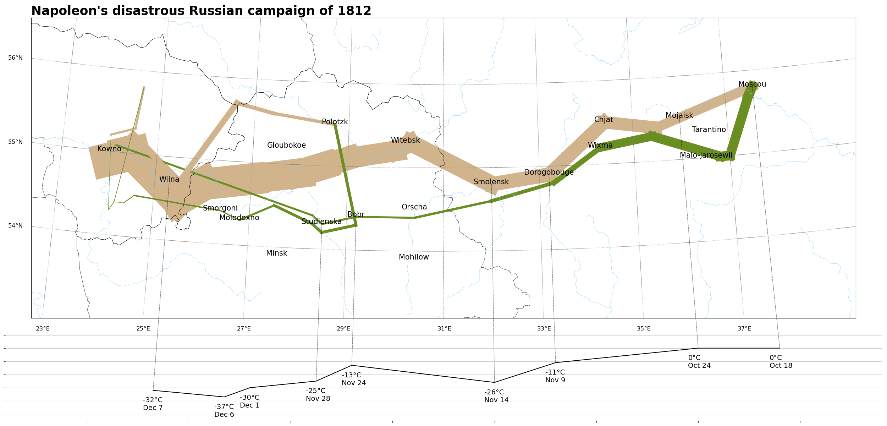

# Napoleon's disastrous Russian campaign of 1812

## Description
This project recreates the famous data visualization of [Charles Minard's *Napoleon's disastrous Russian campaign of 1812*](https://en.wikipedia.org/wiki/Charles_Joseph_Minard#/media/File:Minard.png). I used `pandas` and `sqlite3` to build the database, and utilized `matplotlib` and `basemap` for both the proof of concept and the final result. 

## How to run
- Install [Miniconda](https://www.anaconda.com/docs/getting-started/miniconda/main).

- Download the project files and ensure that `minard.txt` is placed in the `data/` folder within your working directory.

- Set up the environment: 
```shell
conda env create -f environment.yml -n <your_env_name>
```

- Activate the environment:
```shell
conda activate <your_env_name>
```

- Build the database `minard.db` in the `data/` folder:
```shell
python create_minard_db.py
```

- Finally, generate the visualization `minard_clone.png`:
```shell
python plot_with_basemap.py
``` 


